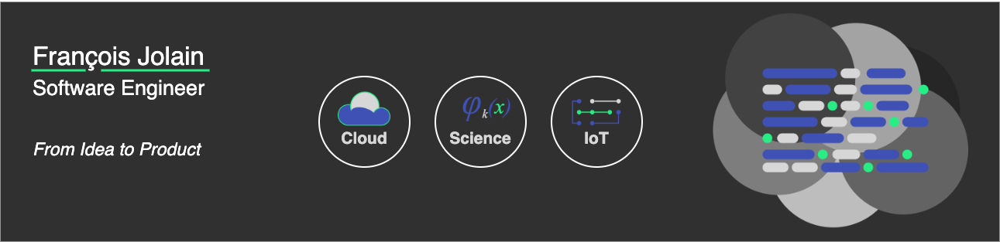

# Hi,

I'm François Jolain, software engineer. I like tech, all kind of tech : software, mathematics, electronics, etc. And create many things: from python scientifics library like [Hadar](https://github/com/hadar-simulator) to cloud platform or IoT.

If you want to see more projects, go to [my gitlab](https://gitlab.com/FrancoisJ) or on my website [jolain.net](https://www/jolain.net)

## Skill
**Cloud**. 

**Science**

**UI**

